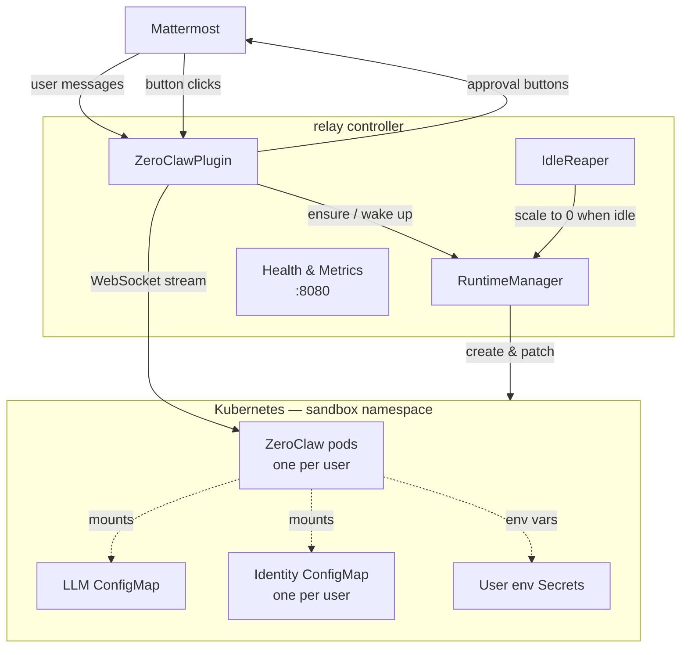

# relay

A Kubernetes-native controller that connects Mattermost chat to [ZeroClaw](https://github.com/zeroclaw-labs/zeroclaw) AI agent sandboxes. Each Mattermost user gets an isolated pod with persistent storage; the controller handles pod lifecycle, message streaming, and approval workflows.

---

## Table of Contents

- [Architecture](#architecture)
- [Request Flow](#request-flow)
- [Key Logic](#key-logic)
  - [Identity & Naming](#identity--naming)
  - [Runtime Provisioning](#runtime-provisioning)
  - [Message Streaming](#message-streaming)
  - [Approval Workflow](#approval-workflow)
  - [Idle Reaper](#idle-reaper)
  - [User Environment Variables](#user-environment-variables)
  - [Workspace Files (SOUL & IDENTITY)](#workspace-files-soul--identity)
- [Autonomy Level](#autonomy-level)
- [Configuration](#configuration)
- [Local Setup](#local-setup)
  - [Pre-commit hooks](#pre-commit-hooks)
- [Production Deployment](#production-deployment)
- [Health & Metrics](#health--metrics)
- [Tests](#tests)
- [RBAC Requirements](#rbac-requirements)

---

## Architecture



The controller holds no database. All state lives in Kubernetes objects: Deployments (with annotations for last-activity timestamps), Services, PVCs, ConfigMaps, and Secrets.

### Project Layout

```
app/
  main.py              # entry point → run_bot(get_settings())
  config.py            # Settings (Pydantic BaseSettings, reads env/.env)
  identity.py          # HMAC naming: object_name, pvc_name, env_secret_name, identity_configmap_name, session_id
  metrics.py           # Prometheus metric definitions
  logging.py           # JSON structured log formatter
  health.py            # HTTP server on :8080 (/healthz /readyz /metrics)
  bot/
    runner.py          # wires Settings → K8s clients → plugin → mmpy_bot.Bot
    plugin.py          # ZeroClawPlugin: handle_message, handle_approval, webhook handlers
    approval.py        # ApprovalManager: request/resolve approval lifecycle
    commands.py        # CommandHandler: !new/!clear/!stop/!help/!env/!soul/!identity
    dialogs.py         # DialogHandler: Mattermost interactive dialogs for env/workspace files
    stream_handler.py  # StreamHandler: frame → Mattermost post text
    formatting.py      # cursor char, update interval, tool icons, truncation
  k8s/
    client.py          # build_k8s_clients() — incluster or kubeconfig mode
    runtime.py         # RuntimeManager — public facade delegating to Lifecycle + UserState
    lifecycle.py       # LifecycleManager — ensure/scale per-user K8s resources
    user_state.py      # UserStateManager — env secrets + workspace file CRUD
    reaper.py          # IdleReaper daemon thread
    workspace.py       # workspace file defaults loader (SOUL.md, IDENTITY.md)
  workspace/
    SOUL.md            # Global default SOUL.md injected into every pod
    IDENTITY.md        # Global default IDENTITY.md injected into every pod
  zeroclaw/
    client.py          # chat_stream() — sync wrapper over async WebSocket

deploy/                # Production K8s manifests
  namespace.yaml
  rbac.yaml            # ServiceAccount + Role + RoleBinding
  deployment.yaml      # relay-controller Deployment
  service.yaml         # ClusterIP on :8080 + :8579
  network-policy.yaml
  ingress.yaml         # nginx: /hooks/ → :8579
  secret.example.yaml

tests/
  test_identity.py
  test_runtime.py         # mocked K8s API
  test_plugin.py          # mocked WebSocket + Mattermost driver
  test_zeroclaw_client.py
```

---

## Request Flow

1. User posts a message in Mattermost.
2. `ZeroClawPlugin.handle_message()` checks for bot commands (`!new`, `!clear`, `!stop`, `!env`, `!soul`, `!identity`, `!autonomy`, `!help`). If none match, it proceeds.
3. `RuntimeManager.ensure_runtime(mm_user_id)` creates (or re-enables) the user's Deployment, Service, and PVC.
4. If the pod is not yet ready, a placeholder post is created ("Preparing session…") and `wait_ready()` polls the pod's `/health` endpoint until 200 or timeout. If the pod is already warm, a cursor post (`▌`) is created immediately.
5. `_run_stream()` derives a session ID from the conversation scope and generation counter, opens a WebSocket to `ws://{service-dns}:{port}/ws/chat?session_id={sid}`, and starts streaming.
6. Frames from ZeroClaw are processed by `StreamHandler` and rendered back into the Mattermost post in near-real-time (~1 update/second).
7. When the `done` frame arrives the final message replaces the placeholder and the post is finalized.
8. After `IDLE_TIMEOUT_SECONDS` of inactivity the `IdleReaper` scales the pod to 0 replicas. The PVC and Service are kept so the next message only waits for a cold-start (~30–60 s).

### Frame Types

| Frame | Effect |
|---|---|
| `chunk` | Text fragment appended to the reply with a trailing cursor |
| `tool_call` | Tool name + icon prepended to the reply |
| `tool_result` | Tool output appended |
| `approval_request` | Mattermost message with Approve / Always / Deny buttons posted; stream blocks until user clicks or timeout |
| `done` | Stream ends, cursor removed, token usage logged, metrics recorded |
| `error` | Error message posted |

---

## Key Logic

### Identity & Naming

`app/identity.py` derives all Kubernetes object names from the Mattermost user ID using HMAC-SHA256:

```
object name      : zc-{hmac(K8S_NAME_SECRET, mm_user_id)[:20]}
pvc name         : {object_name}-data
env secret       : {object_name}-env
identity configmap: {object_name}-identity
session id       : mm-{sha256(scope + ":" + generation)[:24]}
```

Names are **deterministic** (survive pod restarts), **non-reversible** without the secret, and **DNS-safe** (lowercase alphanumeric + hyphens). The generation counter in the session ID is what `!new` / `!clear` increments to create a fresh conversation context without touching K8s resources.

### Runtime Provisioning

`RuntimeManager.ensure_runtime(mm_user_id)` is called on every message and is idempotent. Internally it delegates to `LifecycleManager.ensure_all()`, which creates resources in this order:

1. **Global ConfigMap + provider config Secret** — written once per controller lifecycle. The ConfigMap contains non-sensitive workspace defaults for `SOUL.md` and `IDENTITY.md`. The ZeroClaw `config.toml`, including the provider API key, is stored in a Kubernetes Secret and mounted at `ZEROCLAW_CONFIG_MOUNT`. Updating `OPENAI_MODEL` and restarting the controller is sufficient to change the model for all pods.

2. **Identity ConfigMap** — created once per user (`{name}-identity`). Pre-populated with the global `SOUL.md` and `IDENTITY.md` defaults. Users can override these files via `!soul set` and `!identity set`.

3. **PVC** — created once per user (`ReadWriteOnce`, size from `USER_PVC_SIZE`). Persists across pod scale-up/down cycles. Never deleted by the controller.

4. **Service** — created once per user (`ClusterIP`). Provides stable in-cluster DNS regardless of pod restarts.

5. **Deployment** — created once per user. If it already exists with `replicas=0` (scaled down by the reaper), it is patched to `replicas=1` and the `last-activity` annotation is updated.

Each pod runs with a hardened security context: `runAsNonRoot`, no privilege escalation, all capabilities dropped, `seccomp: RuntimeDefault`. The service account token is not automounted.

```
Volume mounts per pod:
  data         → PVC at ZEROCLAW_DATA_PATH (/zeroclaw-data/workspace)
  model-config → Global Secret at ZEROCLAW_CONFIG_MOUNT (/zeroclaw-data/.zeroclaw/)  [read-only]
  identity     → Per-user Identity ConfigMap, mounts SOUL.md and IDENTITY.md into workspace  [read-only]
  env vars     → Optional Secret {name}-env (user-supplied env, loaded via envFrom)
```

Probes:
| Probe | Config |
|---|---|
| Startup | 15 failures × 1 s = up to 15 s for first start |
| Readiness | period 3 s |
| Liveness | period 5 s, fail after 3 |

### Message Streaming

`chat_stream()` in `app/zeroclaw/client.py` is a synchronous generator that wraps an async WebSocket session in a dedicated event loop. It:

1. Opens a WebSocket connection to `ws://{service_dns}:{port}/ws/chat?session_id={sid}` (ping interval 20 s, open timeout 30 s).
2. Sends `{"type": "message", "content": "<user text>"}`.
3. Yields each incoming JSON frame to the caller.
4. When an `approval_request` frame arrives it calls the `on_approval_request` callback (which blocks in the plugin), then sends the `approval_response` frame before resuming iteration.

`StreamHandler` accumulates frames into a single post string and throttles Mattermost API updates to at most once per second. A heartbeat thread posts a "Thinking…" indicator if no output arrives for 10 seconds, preventing the user from seeing a stale cursor. The `done` frame carries token usage (`input_tokens`, `output_tokens`, `model`) which is emitted to Prometheus and logged.

### Approval Workflow

When ZeroClaw needs to run a potentially dangerous tool it sends an `approval_request` frame before executing it. The controller:

1. Updates the main reply post to "Waiting for approval…".
2. Creates a new Mattermost post in the same thread with three action buttons:
   - **Allow once** → `decision=approve`
   - **Always allow** → `decision=always`
   - **Deny** → `decision=deny`
3. Blocks on a `threading.Event` for up to `timeout_secs` (default 120 s).
4. When the user clicks a button, Mattermost POSTs to `{WEBHOOK_PUBLIC_URL}/hooks/approval`. The webhook handler records the decision, deletes the button post, and signals the event.
5. The unblocked handler sends `{"type": "approval_response", "decision": "…"}` back over the WebSocket. On timeout the decision defaults to `deny` and the button post is updated with a timeout notice.

### Idle Reaper

`IdleReaper` runs as a daemon thread, waking every `REAPER_INTERVAL_SECONDS` (default 60 s):

1. Lists all Deployments labeled `ai.relay.io/part-of=zeroclaw-runtime`.
2. Filters to those with `replicas > 0` whose `ai.relay.io/last-activity` annotation is older than the TTL.
3. Scales each idle Deployment to `replicas=0`.
4. Leaves the PVC and Service intact so the next message only needs to wait for a pod cold-start rather than full resource recreation.

### User Environment Variables

Users can store arbitrary environment variables that are injected into their ZeroClaw pod via a K8s Secret (`{name}-env`). This is useful for passing API keys to tools running inside the sandbox.

Commands:
- `!env set KEY` — posts a button that opens a secure Mattermost interactive dialog (password input field) to enter the value. The value is never echoed in chat.
- `!env list` — lists key names (never values).
- `!env del KEY` — removes the key.

Any change to the Secret triggers a rolling restart of the user's pod (via the `kubectl.kubernetes.io/restartedAt` annotation) so the new value takes effect immediately.

### Workspace Files (SOUL & IDENTITY)

Each ZeroClaw pod receives two workspace files mounted from the per-user identity ConfigMap (`{name}-identity`):

- **SOUL.md** — defines the agent's core principles and personality.
- **IDENTITY.md** — defines who the agent is.

Global defaults live in `app/workspace/`. Per-user overrides are stored in the identity ConfigMap and take precedence. Changes trigger a rolling restart of the user's pod.

Commands:
- `!soul show` / `!identity show` — display the current file (or confirm the global default is in use).
- `!soul set` / `!identity set` — opens a Mattermost interactive dialog with a textarea pre-filled with the current content.
- `!soul reset` / `!identity reset` — reverts the file to the global default.

### Autonomy Level

Each user can control whether ZeroClaw requires approval before executing potentially dangerous tools. The level is stored in the per-user identity ConfigMap and written into the ZeroClaw `config.toml` on every pod start.

| Level | Behaviour |
|---|---|
| `supervised` (default) | ZeroClaw sends an `approval_request` frame before sensitive tool calls |
| `full` | ZeroClaw runs tools without pausing for approval |

Commands:
- `!autonomy show` — display the current autonomy level.
- `!autonomy set full` / `!autonomy set supervised` — change the level (takes effect on the next message).
- `!autonomy reset` — revert to the default (`supervised`).

---

## Configuration

All configuration is via environment variables or a `.env` file. Copy `.env.example` and fill in the required values.

### Mattermost

| Variable | Required | Default | Description |
|---|---|---|---|
| `MATTERMOST_URL` | yes | — | Base URL, e.g. `https://chat.example.com` |
| `MATTERMOST_PORT` | no | `443` | Port (usually 443 or 8065) |
| `MATTERMOST_TEAM` | yes | — | Team name |
| `MATTERMOST_BOT_TOKEN` | yes | — | Bot account token from Mattermost admin |
| `MATTERMOST_BOT_USERNAME` | yes | — | Bot username |
| `MATTERMOST_THREAD_REPLIES` | no | `true` | `true`: each top-level post starts a thread-scoped context; `false`: scope is channel + user |

### Kubernetes

| Variable | Required | Default | Description |
|---|---|---|---|
| `K8S_NAMESPACE` | no | `sandbox` | Namespace where user pods run |
| `K8S_MODE` | no | `incluster` | `incluster` (ServiceAccount) or `kubeconfig` |
| `K8S_KUBECONFIG_PATH` | no | — | Path to kubeconfig when `K8S_MODE=kubeconfig` |
| `K8S_NAME_SECRET` | yes | — | 32-byte hex secret for HMAC pod naming |

### LLM

| Variable | Required | Default | Description |
|---|---|---|---|
| `OPENAI_API_KEY` | yes | — | API key stored in the Kubernetes Secret-mounted ZeroClaw config |
| `OPENAI_BASE_URL` | no | `https://api.openai.com/v1` | OpenAI-compatible endpoint |
| `OPENAI_MODEL` | no | `gpt-4o-mini` | Model name |

### ZeroClaw Sandbox Pods

| Variable | Default | Description |
|---|---|---|
| `ZEROCLAW_IMAGE` | `ghcr.io/zeroclaw-labs/zeroclaw:latest` | Container image |
| `ZEROCLAW_PORT` | `42617` | WebSocket port inside the pod |
| `ZEROCLAW_DATA_PATH` | `/zeroclaw-data/workspace` | Workspace PVC mount path |
| `ZEROCLAW_CONFIGMAP` | `zeroclaw-identity-default` | Name of the shared non-sensitive workspace defaults ConfigMap |
| `ZEROCLAW_PROVIDER_CREDENTIALS_SECRET` | `zeroclaw-config-default` | Name of the shared Secret containing ZeroClaw `config.toml` |
| `ZEROCLAW_CONFIG_MOUNT` | `/zeroclaw-data/.zeroclaw/` | ZeroClaw config mount path |
| `ZEROCLAW_CPU_REQUEST` | `500m` | CPU request |
| `ZEROCLAW_CPU_LIMIT` | `2` | CPU limit |
| `ZEROCLAW_MEMORY_REQUEST` | `1Gi` | Memory request |
| `ZEROCLAW_MEMORY_LIMIT` | `4Gi` | Memory limit |

### Storage

| Variable | Default | Description |
|---|---|---|
| `USER_PVC_SIZE` | `5Gi` | PVC size per user |
| `USER_PVC_STORAGE_CLASS` | — | Storage class name (empty = cluster default) |

### Lifecycle & Webhooks

| Variable | Default | Description |
|---|---|---|
| `IDLE_TIMEOUT_SECONDS` | `3600` | Idle time before pod is scaled to 0 |
| `POD_READY_TIMEOUT_SECONDS` | `120` | Max wait for a pod to become healthy |
| `REAPER_INTERVAL_SECONDS` | `60` | How often the idle check runs |
| `WEBHOOK_HOST_PORT` | `8579` | Port the approval webhook server listens on |
| `WEBHOOK_PUBLIC_URL` | — | URL Mattermost uses to deliver button-click events |
| `LOG_LEVEL` | `20` | Python logging level (20 = INFO) |
| `SSL_VERIFY` | `false` | SSL certificate verification |

---

## Local Setup

### Pre-commit hooks

Install once after cloning:

```bash
uv sync --group dev
uv run pre-commit install
```

From then on, every `git commit` automatically runs ruff (lint + format), YAML/TOML validation, trailing-whitespace cleanup, merge-conflict detection, and a private-key guard. To run all hooks manually:

```bash
uv run pre-commit run --all-files
```

### Tilt + kind

End-to-end local development with real pod provisioning.

```bash
# Prerequisites
brew install tilt kind

# Create a local cluster
kind create cluster --name relay

# Configure
cp .env.example .env
# Edit .env — Mattermost URL depends on your OS:
#
#   macOS:  MATTERMOST_URL=http://host.docker.internal
#   Linux:  MATTERMOST_URL=http://<docker-bridge-ip>
#           (find it with: docker network inspect bridge | grep Gateway)
#
# Also set: MATTERMOST_PORT=8065
#           K8S_MODE=kubeconfig

tilt up
```

> **Note:** the Tiltfile only allows `kind-relay` and `kind-kind` contexts. Running `tilt up` against any other cluster will fail immediately.

Tilt will:
- Create namespace `sandbox` and apply RBAC
- Build the relay image locally (no registry push)
- Parse `.env` into K8s Secret `relay-controller`
- Deploy the controller and Mattermost + PostgreSQL
- Enable hot reload: changes to `./app/` sync to the container and restart the process
- Port-forward `localhost:8579` → controller webhook port

`tilt down` tears down the controller and deletes all ZeroClaw runtime resources.

---

## Production Deployment

```bash
# 1. Create namespace and RBAC
kubectl apply -f deploy/namespace.yaml
kubectl apply -f deploy/rbac.yaml

# 2. Create secret from .env
kubectl create secret generic relay-controller -n sandbox \
  --from-env-file=.env --dry-run=client -o yaml | kubectl apply -f -

# 3. Apply remaining manifests
kubectl apply -f deploy/network-policy.yaml
kubectl apply -f deploy/service.yaml
kubectl apply -f deploy/deployment.yaml
kubectl apply -f deploy/ingress.yaml   # requires nginx ingress controller

# 4. Verify
kubectl rollout status -n sandbox deployment/relay-controller
curl https://your-domain/hooks/healthz
```

`deploy/ingress.yaml` routes `/hooks/` to the webhook port (8579) so Mattermost can deliver button-click events. Requires nginx ingress controller.

---

## Health & Metrics

The controller exposes an HTTP server on port **8080**:

| Path | Description |
|---|---|
| `/healthz` | Always 200 while the process is running |
| `/readyz` | 200 after bot initialization, 503 before |
| `/metrics` | Prometheus metrics |

### Prometheus Metrics

| Metric | Type | Description |
|---|---|---|
| `relay_message_duration_seconds` | Histogram | End-to-end message processing time |
| `relay_messages_total` | Counter | Messages by outcome: success / timeout / error |
| `relay_ensure_runtime_seconds` | Histogram | Time spent in `ensure_runtime()` |
| `relay_pod_startup_seconds` | Histogram | Time from pod creation to first healthy response |
| `relay_tool_calls_total` | Counter | Tool invocations by tool name |
| `relay_tool_call_duration_seconds` | Histogram | Tool execution time |
| `relay_approvals_total` | Counter | Approval decisions: approve / always / deny / timeout |
| `relay_approval_wait_seconds` | Histogram | Time from approval request to user click |
| `relay_active_clients` | Gauge | Messages currently in flight |
| `relay_active_pods` | Gauge | Deployments with replicas > 0 |
| `relay_pods_reaped_total` | Counter | Pods scaled down by the idle reaper |
| `relay_k8s_errors_total` | Counter | K8s API errors by operation |
| `relay_reaper_run_seconds` | Histogram | Idle check duration |
| `relay_tokens_total` | Counter | LLM tokens consumed by kind (input/output) and model |
| `relay_llm_request_duration_seconds` | Histogram | Time from stream open to `done` frame |

---

## Tests

```bash
uv sync --group dev
uv run pytest tests/ -v
```

---

## RBAC Requirements

The controller's ServiceAccount needs these permissions in `K8S_NAMESPACE`:

| API group | Resources | Verbs |
|---|---|---|
| core | pods, services, persistentvolumeclaims, configmaps, secrets, events | get, list, watch, create, update, patch, delete |
| apps | deployments | get, list, watch, create, update, patch, delete |

`deploy/rbac.yaml` configures this automatically.
