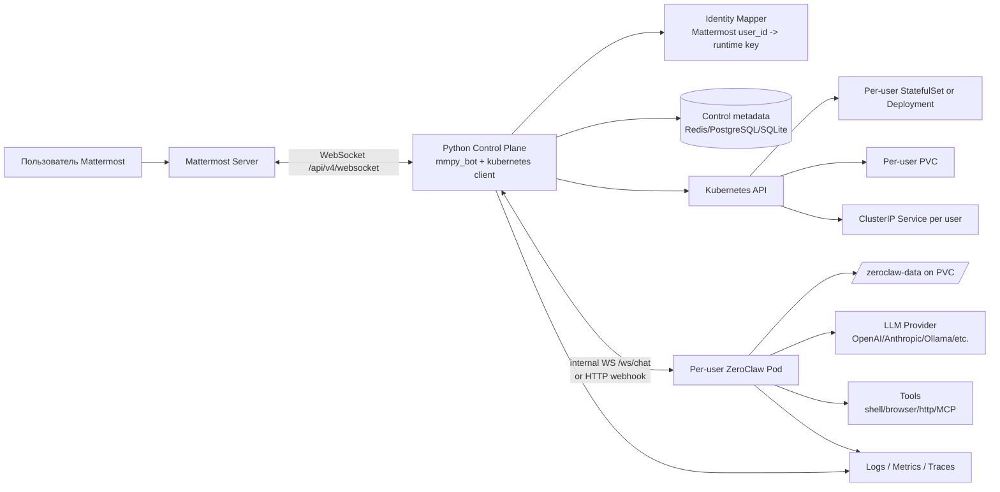
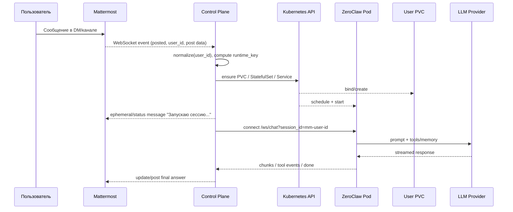
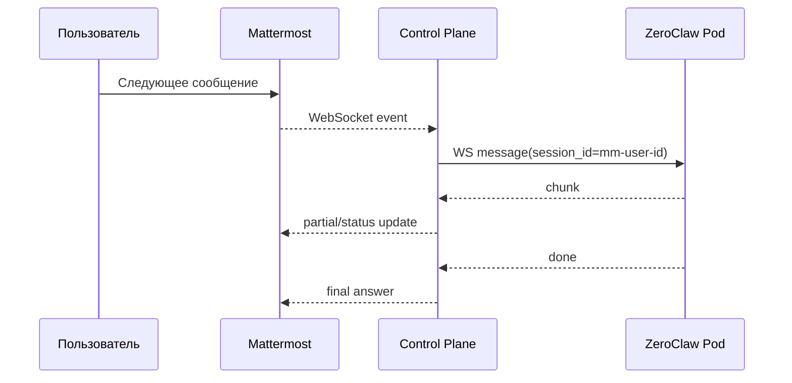

# Аналитический отчёт по сервису Mattermost → Kubernetes → ZeroClaw с персональными AI-подами

## Исполнительное резюме

Запрошенная архитектура **реализуема** и выглядит наиболее устойчиво в форме **двухконтурной системы**:  
**центральный Python-контроллер** подключается к Mattermost через один bot account и WebSocket с помощью `mmpy_bot`, а для каждого пользователя по событию создаёт **отдельный pod в Kubernetes** с **персистентным PVC** и запущенным **ZeroClaw** как персональным runtime. Такой дизайн хорошо совпадает с тем, как Mattermost предоставляет real-time события по `/api/v4/websocket`, как `mmpy_bot` построен поверх WebSocket API Mattermost, и как ZeroClaw задуман как **single-binary runtime** c gateway/websocket/webhook поверх per-workspace состояния. citeturn5search0turn24search0turn11view0turn11view1turn11view5

Ключевое архитектурное решение: **не давать каждому пользовательскому pod напрямую подключаться к Mattermost**. Вместо этого Mattermost аутентифицируется только один раз — в центральном контроллере; далее контроллер сопоставляет `Mattermost user_id` с канонической персоной runtime, создаёт или будит пользовательский pod и проксирует чат в pod по **внутрикластерному HTTP/WebSocket**. Это уменьшает площадь атаки, упрощает ротацию токенов Mattermost, устраняет необходимость хранить Mattermost-токены во всех pod и даёт единое место для аудита, rate limiting и политики provisioning. Возможность такого подхода опирается на Mattermost WebSocket authentication, наличие `user_id` в WebSocket events, WS/chat gateway у ZeroClaw и встроенный reconnect/plugin model у `mmpy_bot`. citeturn5search0turn6search0turn11view5turn24search0

Для хранения состояния я рекомендую воспринимать **сырой Mattermost `user_id` как канонический идентификатор**, но в Kubernetes именах использовать **HMAC(user_id)** или другой детерминированный безопасный alias. Сам ZeroClaw ожидает персистентное состояние в `/zeroclaw-data`, а его SQLite/workspace-файлы живут внутри этого дерева; следовательно, для production-режима нужен **один PVC на пользователя**. ZeroClaw прямо документирует, что его runtime — **single-writer per workspace** и не должен масштабироваться горизонтально для одного workspace; отсюда базовое правило: **один пользователь = один pod = один workspace = один PVC**, без multi-replica scaling внутри пользователя. citeturn13view0turn11view3

Наиболее практичный шаблон Kubernetes зависит от ожидаемого масштаба. Для малых и средних установок удобнее **StatefulSet на пользователя с `replicas: 0/1`**: он даёт стабильную identity и понятную политику жизни PVC, а Kubernetes поддерживает retention policy для PVC у StatefulSet. Для более высоких масштабов или более агрессивного scale-to-zero можно уйти в **Deployment + отдельный PVC + собственный контроллер жизни**, потому что так проще управлять волнами создания/удаления тысяч short-lived runtimes. В обоих вариантах StorageClass должен поддерживать динамический provisioning PVC; для удаления/сохранения дисков надо явно определить retention-политику, а не оставлять её неявной. citeturn8search9turn8search4turn8search14

По безопасности минимальный baseline таков: namespace с **Pod Security Standards: restricted**, `runAsNonRoot`, `allowPrivilegeEscalation: false`, `readOnlyRootFilesystem: true`, `capabilities.drop: ["ALL"]`, `seccompProfile: RuntimeDefault`, автомаунт service account token выключен для пользовательских pod, NetworkPolicy на **default-deny** с узким allowlist на DNS, LLM endpoint и нужные внутренние сервисы. Для чувствительных пользователей/данных уместно добавить `runtimeClassName` с gVisor/Kata-подобной изоляцией, что Kubernetes прямо рекомендует для workload с повышенными требованиями к изоляции. citeturn33search2turn33search0turn8search5turn8search1turn33search14turn33search1turn33search4

С точки зрения эксплуатационной зрелости, дизайн должен сразу включать: structured logs, Prometheus-метрики, OpenTelemetry traces, probes, graceful shutdown hooks, gap-recovery после потери связи с Mattermost, и отдельный reaper для idle shutdown. У ZeroClaw есть готовые structured logs, Prometheus metrics и OpenTelemetry traces, а `mmpy_bot` умеет reconnect после потери соединения. Но официальные изученные источники не описывают гарантию event replay в Mattermost WebSocket после обрыва, поэтому систему нужно проектировать так, будто **потеря real-time событий возможна**; лучший способ — хранить `last_seen_post_ts`/`post_id` и делать REST gap-check после восстановления. Это уже инженерная надстройка поверх официальных primitives. citeturn12search0turn24search0turn36search2

## Рекомендуемая архитектура и последовательности

Ниже — **рекомендуемая** целевая архитектура. Она синтезирована из возможностей Mattermost WebSocket API, `mmpy_bot`, ZeroClaw gateway/daemon и стандартных Kubernetes primitives. citeturn5search0turn24search0turn11view0turn11view1turn13view0



В этой схеме только control plane знает Mattermost bot token. Пользовательский pod знает только собственный `runtime_id`, путь к PVC и, если требуется, провайдерские секреты или внутренний прокси-эндпоинт LLM. Это согласуется с тем, что Mattermost поддерживает bot accounts и bearer authentication, `mmpy_bot` ожидает bot account/token, а ZeroClaw умеет принимать сообщения через gateway/websocket/webhook, не требуя прямого подключения к Mattermost. citeturn1view3turn24search0turn11view5turn11view2

**Рекомендуемый режим исполнения ZeroClaw в pod**: по умолчанию `zeroclaw daemon`, если нужен полный runtime со scheduler/heartbeat/agent loop; если у вас строго интерактивный режим без автономных задач, можно тестировать облегчённый `zeroclaw gateway`, но финальный выбор стоит подтвердить в интеграционном тесте, так как официальная production shape в документации описывает обычный always-on запуск в виде `zeroclaw daemon`, внутри которого уже есть gateway listener и per-session agent loop. citeturn10search3turn11view1

Ниже — **последовательность холодного старта** на первое сообщение от пользователя. Она показывает, где именно должна жить логика создания pod и когда user получает промежуточный ответ в Mattermost. citeturn24search0turn11view5turn13view0turn34search2



**Тёплый путь** должен занимать минимум действий: event пришёл по WebSocket Mattermost → control plane нашёл already-ready pod → отправил сообщение в уже открытый внутренний WS → получил stream → отредактировал/дописал ответ. ZeroClaw WS protocol позволяет session resumption через `session_id`, отдаёт `chunk`, `tool_call`, `tool_result` и `done`, а также имеет явный approval protocol для supervised tool calls. Это очень удобно для стриминга ответа и для интерактивных подтверждений прямо в Mattermost. citeturn11view5



Практический вывод: **не делайте Mattermost ↔ per-user pod сетевую связность напрямую**. Все внешние callback endpoint для slash commands, interactive buttons и dialogs тоже должны идти только в control plane, а не в пользовательские pod. Это и безопаснее, и лучше согласуется с ограничением Mattermost на интеграционные HTTP timeouts по interactive messages/slash commands, который по умолчанию составляет **3 секунды**. Для долгой работы controller должен быстро отвечать Mattermost “ACK”, а уже потом продолжать в фоне и постить результат отдельно. citeturn28search13turn28search7turn28search0

## Идентификация, аутентификация и маршрутизация сети

**Базовая аутентификация к Mattermost** в этом проекте должна быть через **bot account access token**. Mattermost рекомендует использовать API вместе с bot accounts; bot access tokens не истекают автоматически, хотя их можно программно ротировать через REST API. `mmpy_bot` v2.x также прямо исходит из модели “создайте bot account и используйте Access Token”. citeturn2search11turn1view3turn24search0

Для связи по WebSocket Mattermost поддерживает несколько вариантов аутентификации: стандартные API methods через cookie или explicit `Authorization` header, а также `authentication_challenge` уже после connect на `/api/v4/websocket`. После успешной аутентификации сервер начинает отдавать WebSocket events, где у событий есть `event`, `data` и `broadcast`, причём в них фигурирует `user_id`. Это даёт достаточную основу, чтобы брать именно **Mattermost `user_id` как канонический subject** всей остальной системы. citeturn5search0turn6search0turn36search2

Рекомендованная схема идентичности выглядит так:

| Слой | Идентификатор | Назначение |
|---|---|---|
| Каноническая бизнес-identity | сырой Mattermost `user_id` | единственный источник истины для пользователя citeturn6search0turn36search2 |
| Kubernetes-safe alias | `runtime_key = HMAC-SHA256(cluster_secret, user_id)[:20]` | DNS-safe имена `StatefulSet`, `Service`, `PVC`, labels |
| ZeroClaw session id | `mm-<user_id>` | фиксация и resumption сессии в `ws/chat` citeturn11view5 |
| Внутренний RPC auth | short-lived JWT с `sub=user_id` | аутентификация controller → pod без Mattermost token |

Такой подход минимизирует утечки PII в Kubernetes object names и одновременно сохраняет требование “use Mattermost userid as unique id”: **сырое `user_id` остаётся каноническим ключом**, а HMAC — только техническое представление для K8s имён.

Если проекту потребуется **user-delegated access**, а не только bot-mediated chat, у Mattermost есть OAuth 2.0 applications: после authorize приложение получает access token и может делать действия **с правами самого пользователя**. Но это **другая модель угроз и хранения секретов**: токены придётся хранить как персональные секреты, их обработка уже становится частью privacy/compliance scope. Для базового варианта “AI-ассистент отвечает ботом и использует `user_id` как identity” OAuth не нужен. citeturn36search7

Сетевой дизайн я рекомендую таким:

| Поток | Рекомендация | Почему |
|---|---|---|
| Mattermost → Control Plane | один outbound WebSocket, инициируемый из control plane | проще токены, reconnect, аудит; естественно для `mmpy_bot` citeturn24search0turn5search0 |
| Control Plane → user pod | ClusterIP + внутренний WebSocket к `/ws/chat` или HTTP webhook | ZeroClaw уже имеет WS/chat и webhook ingress внутри gateway citeturn11view5turn11view2 |
| Ingress извне к user pod | **не использовать** | не нужен для основного пути; увеличивает поверхность атаки |
| Slash/button callbacks | только на control plane | Mattermost interactive actions — это HTTP POST в интеграцию, не в user pod citeturn28search0turn28search7 |

Если всё же нужен внешний ingress, например для slash commands или interactive buttons, лучше опираться на **Gateway API**, а не строить новое на `ingress-nginx`: Kubernetes официально объявил о retirement Ingress-NGINX в марте 2026 года, и сегодня правильнее смотреть в сторону Gateway API, который уже является GA для `Gateway`, `GatewayClass` и `HTTPRoute`, а с v1.2 включил WebSocket/timeouts и т.д. citeturn29search15turn30search12turn30search1turn30search9

## Жизненный цикл pod, PVC, запуск сессии и оценка ресурсов

ZeroClaw документирует контейнерный режим как работу с персистентным состоянием под `/zeroclaw-data`, а также прямо говорит, что runtime — **single-instance per workspace** и что его не следует горизонтально масштабировать для одного workspace. Это делает наиболее естественным lifecycle “создать на пользователя” → “масштабировать между 0 и 1” → “оставить PVC жить дольше, чем pod”. citeturn13view0

Для pod lifecycle я рекомендую следующую модель:

| Событие | Действие |
|---|---|
| Первое сообщение пользователя | create/scale-up `StatefulSet` или `Deployment`, создать/привязать PVC, открыть внутренний WS |
| Сообщение активному пользователю | reuse существующего pod и того же `session_id` |
| Нет активности N минут | закрыть внутренний WS, отправить “idle shutdown” уведомление, scale-to-zero или delete pod, PVC оставить |
| Удаление пользователя/истечение retention | экспорт/снимок при необходимости, затем delete PVC |
| Node failure | Kubernetes пересоздаёт pod; PVC остаётся и перевешивается на новый pod citeturn8search9turn8search14 |

По шаблонам хранения есть три реалистичных варианта:

| Паттерн | Когда использовать | Плюсы | Минусы |
|---|---|---|---|
| `StatefulSet` на пользователя + `volumeClaimTemplates` | до сотен/низких тысяч пользователей, важна простота | stable identity, встроенный PVC lifecycle, естественная модель single-writer citeturn8search9turn8search4 | больше Kubernetes objects |
| `Deployment` + заранее созданный PVC | больше масштаб/больше контроля | легче писать свой lifecycle controller | retention/cleanup надо писать самим |
| `emptyDir` | только dev/test | быстрый старт | данные теряются при рестарте; ZeroClaw sample manifests сами предупреждают, что это не production citeturn26view0 |

Если вы идёте через `StatefulSet`, имеет смысл использовать `persistentVolumeClaimRetentionPolicy` и явно выбрать стратегию. Kubernetes отдельно документирует, что PVC у StatefulSet по умолчанию не удаляются при удалении Pod/StatefulSet, а новая retention policy позволяет контролировать, удалять ли PVC при delete/scale-down или сохранять их. Для персональных ассистентов почти всегда разумнее начинать с **Retain/Retain**, а реальный cleanup делать отдельным reaper’ом после retention TTL. citeturn8search9turn8search4

Поскольку ZeroClaw сохраняет workspace и память в `/zeroclaw-data/workspace/`, PVC должен монтироваться именно туда или на его верхний каталог. В official container docs указано, что если этот volume не монтировать, история будет теряться при каждом restart. citeturn13view0

Оптимизация времени старта должна строиться вокруг четырёх факторов:  
**маленький образ**, **локальный image cache**, **простой bootstrap**, **готовность только после инициализации runtime**. Здесь полезны следующие первичные факты: official `ghcr.io/zeroclaw-labs/zeroclaw:latest` — distroless image; Docker multi-stage builds уменьшают размер и attack surface; Kubernetes по умолчанию ставит `imagePullPolicy: IfNotPresent`, что позволяет не тянуть образ повторно, если он уже есть на node; DaemonSet удобен для node-local pre-pull patterns. citeturn13view0turn31search0turn31search2turn32search0turn32search1

Для readiness и стабильности старта обязательно нужны `startupProbe`, `readinessProbe` и `livenessProbe`. Kubernetes прямо разделяет эти роли: startup probe защищает медленный старт, readiness убирает pod из serving path, пока тот не готов, а liveness перезапускает зависший контейнер. Для ассистентного runtime это критично: без `startupProbe` вы получите ложные рестарты при холодном старте или при прогреве модели/FS. citeturn34search2turn34search0

Ниже — **практическая таблица ресурсов** для одного пользователя. Это не привязка к конкретному облаку, а инженерный baseline для capacity planning.

| Профиль пользователя | Requests | Limits | PVC | Типичный режим работы | Потребление в месяц на пользователя |
|---|---:|---:|---:|---|---:|
| Chat-only | 250m CPU / 512Mi RAM | 1 CPU / 2Gi | 2Gi RWO | только диалог, без тяжёлых tools | always-on: ~182.5 vCPUh, ~365 GiBh, 2 GiB-month |
| Chat + shell/http tools | 500m / 1Gi | 2 CPU / 4Gi | 5Gi RWO | основной продуктивный режим | always-on: ~365 vCPUh, ~730 GiBh, 5 GiB-month |
| Browser / code / MCP-heavy | 1 CPU / 2Gi | 4 CPU / 8Gi | 10–20Gi RWO/RWX* | тяжёлые workflows | always-on: ~730 vCPUh, ~1460 GiBh, 10–20 GiB-month |

\* RWX нужен редко; чаще достаточно RWO. Kubernetes PVC access modes и StorageClasses позволяют это задать явно. citeturn8search14turn1view5

Провайдер-независимая формула стоимости на пользователя в месяц:

```text
Infra_cost_user =
  (vCPU_hours * Price_vCPU_hour) +
  (GiB_hours * Price_GiB_hour) +
  (PVC_GiB_month * Price_PVC_GiB_month) +
  egress +
  observability +
  backups
```

Практически, **LLM cost почти всегда надо считать отдельно** и часто именно он становится доминирующей переменной. Инфраструктурный выигрыш достигается не столько мегатонкой настройкой CPU-limit, сколько агрессивным **idle shutdown**, reuse session, pre-pull image и тем, что user pod в idle на самом деле не живёт 24/7.

## Безопасность, наблюдаемость, отказоустойчивость и соответствие требованиям

Ниже — **минимальный security checklist** для production. Он основан на Pod Security Standards, SecurityContext, ServiceAccount/RBAC, NetworkPolicy, seccomp/AppArmor/SELinux и RuntimeClass guidance из Kubernetes, а также на практической установке, что Mattermost token должен жить только в control plane. citeturn33search2turn33search0turn8search3turn8search8turn8search1turn8search5turn33search4turn33search14turn33search1

| Контроль | Что выставить | Зачем |
|---|---|---|
| Namespace policy | `pod-security.kubernetes.io/enforce=restricted` | запрет privilege escalation и опасных volume/host settings citeturn33search2turn33search7 |
| ServiceAccount user pod | `automountServiceAccountToken: false` | pod не должен уметь говорить с K8s API по умолчанию citeturn8search8turn8search13 |
| RBAC control plane | отдельный SA + Role/RoleBinding только на `pods`, `statefulsets`, `services`, `pvc`, `events` в своём namespace | принцип наименьших привилегий citeturn8search3turn8search8 |
| SecurityContext | `runAsNonRoot: true`, `allowPrivilegeEscalation: false`, `readOnlyRootFilesystem: true`, `capabilities.drop: ["ALL"]` | базовая hardening-поверхность контейнера citeturn33search0turn33search2 |
| seccomp | `seccompProfile: RuntimeDefault` | ограничение syscalls и уменьшение blast radius citeturn8search0turn8search5 |
| RuntimeClass | gVisor/Kata для чувствительных workload | усиленная изоляция от container escape citeturn33search1turn33search14 |
| NetworkPolicy | default-deny ingress/egress; allow только DNS, control plane, LLM endpoints, нужные внутренние сервисы | сегментация пользовательских pod citeturn8search1turn8search6 |
| Secrets | Mattermost bot token — только в control plane; provider keys — через K8s Secret/CSI external secrets; не писать inline в config | ZeroClaw сам предупреждает против checked-in inline keys citeturn11view4 |
| PVC isolation | один PVC на пользователя, не шарить между разными assistant pods | уменьшение cross-user leakage и соблюдение single-writer per workspace citeturn13view0turn11view3 |
| Logs/traces | не логировать raw tokens, prompt secrets, full tool args с секретами | ZeroClaw отдельно описывает boundaries around approval summaries and secret fields citeturn11view5 |

По observability ZeroClaw уже даёт хороший фундамент: **structured logs, Prometheus metrics и OpenTelemetry traces включены по умолчанию в release build**. Для вашего control plane на Python надо лишь привести телеметрию к той же модели и проставлять стабильные correlation keys: `mattermost_user_id_hash`, `runtime_key`, `post_id`, `channel_id`, `session_id`, `pod_name`. Это сильно упрощает поиск инцидентов “почему ответил именно этот pod именно на этот post”. citeturn12search0turn11view1

Минимальный набор SLI/SLO для сервиса такой:  
`cold_start_ms`, `time_to_first_token_ms`, `answer_success_rate`, `ws_reconnect_count`, `active_user_pods`, `idle_reaped_total`, `pvc_attach_latency_ms`, `llm_error_rate`, `tool_approval_timeout_total`, `message_queue_depth`. ZeroClaw already exposes signals для service/channel/provider health, а у runtime есть receipts и наблюдаемость по provider routing. citeturn11view1turn12search5turn12search8

Ниже — основные failure modes и меры восстановления.

| Failure mode | Симптом | Мера |
|---|---|---|
| Обрыв Mattermost WebSocket | bot “немеет” | использовать встроенный reconnect `mmpy_bot`; после reconnect делать REST gap-check по последней увиденной точке, так как в просмотренных источниках я не нашёл официальной replay-гарантии для пропущенных WS events citeturn24search0turn36search2 |
| Медленный cold start user pod | пользователь ждёт десятки секунд | pre-pull image, `IfNotPresent`, `startupProbe`, заранее созданный PVC, маленький образ, быстрый ACK в Mattermost citeturn32search0turn32search1turn34search2turn31search0turn13view0 |
| Зависание runtime | нет новых токенов/ответ не завершён | liveness/readiness/startup probes, graceful restart, postmortem по traces citeturn34search2turn34search0 |
| Потеря node / voluntary eviction | pod умирает при drain/upgrade | controller pod закрыть PDB; user pods восстанавливать из retained PVC; использовать `PreStop` для flush state citeturn34search1turn34search14turn34search5 |
| LLM outage / rate limit | ошибки от модели | ZeroClaw поддерживает fallback chains/routing; включить резервную модель/провайдера citeturn1view0turn12search5 |
| Разрыв controller↔pod во время approval | tool call остаётся подвешен | у ZeroClaw WS approval auto-deny after timeout when client disconnects; это хороший fail-closed default citeturn11view5 |
| Потеря/перепривязка PVC | runtime стартует “чистым” | проверять PVC binding и workspace marker перед admission в ready path; не использовать `emptyDir` в production citeturn26view0turn13view0 |

По legal/privacy/data residency это технический, а не юридический вывод, но несколько вещей очевидны. Во-первых, **Mattermost `user_id`, DM transcripts, tool outputs и ZeroClaw memory** — это персональные данные в смысле GDPR, потому что GDPR определяет personal data как информацию, относящуюся к идентифицированному или идентифицируемому физическому лицу, а обработки включают хранение, использование, передачу и удаление. Во-вторых, трансграничная передача в third country требует appropriate safeguards. citeturn21search3turn21search2

Практические следствия для этого проекта:

| Область | Практическое требование |
|---|---|
| Data residency | кластер, PVC snapshots, backup storage, logs/traces и LLM endpoint должны находиться в одной допустимой юрисдикции |
| Retention | retention PVC не должна противоречить retention/Legal Hold в Mattermost; Mattermost умеет data retention и legal hold, это надо синхронизировать политикой lifecycle ваших PVC citeturn21search1turn21search7turn21search5 |
| Auditability | нужно уметь от `Mattermost user_id` найти поды, PVC, логи, бэкапы и удалить/экспортировать их по legal request |
| Provider choice | если residency строгая, ZeroClaw можно направить в локальный Ollama или другой self-hosted/openai-compatible endpoint вместо публичного SaaS LLM citeturn11view4turn1view0 |
| Secrets handling | provider credentials и Mattermost tokens — отдельно от пользовательского контента; не смешивать в PVC |

## Сравнение существующих open-source решений

Ниже — сравнение решений, которые реально полезны для этой задачи как готовые компоненты или как референс-архитектуры. Я намеренно сравниваю не только “Mattermost bots”, но и “per-user pod runtimes”, потому что ваша задача на стыке этих двух миров.

| Решение | Лицензия | Зрелость | Сильные стороны | Разрывы относительно вашей цели |
|---|---|---|---|---|
| **ZeroClaw** | Apache-2.0 citeturn25search8 | очень активный проект; свежие релизы и активный monorepo citeturn9search13turn25search8 | single binary; providers/channels/tools/memory/gateway; WS/chat; webhooks; контейнерный distroless image; full observability; workspace isolation citeturn11view0turn11view5turn13view0turn12search0turn11view3 | в изученных официальных источниках нет first-class Mattermost channel; интеграцию придётся делать внешним Python control plane |
| **OpenClaw** | MIT citeturn18search1 | очень активный, частые стабильные/бета релизы citeturn18search0turn18search18 | имеет **нативный Mattermost plugin**: bot token, slash commands, button callbacks, directory adapter, multi-account, DM routing citeturn17view0 | не Python; не ZeroClaw; другой runtime/экосистема |
| **mmpy_bot** | MIT citeturn1view2 | рабочий и актуальный PyPI package 2.2.1; v2 refactor citeturn24search0 | Python; Mattermost WebSocket-based; plugin hooks; auto-reconnect; own webhook server; click functions; job scheduling citeturn24search0turn22search6 | нет pod orchestration, нет PVC lifecycle, нет per-user runtime model |
| **python-mattermost-driver** | MIT citeturn14search0 | функционален, но выглядит стагнирующим: последний PyPI release 2022 citeturn14search2turn14search9 | низкоуровневый REST/WS driver; годится как substrate библиотека citeturn14search1turn14search5 | меньше готовых abstractions, выше поддержочный риск, no plugin framework |
| **JupyterHub KubeSpawner** | BSD-3-Clause citeturn19search4 | очень зрелый паттерн per-user pods; docs описывают scaling на большие инсталляции citeturn20search3 | проверенный шаблон “один пользователь → один pod → один PVC”, templated names, automatic PVC creation, configurable deletion policy citeturn20search5turn20search1turn20search12 | не Mattermost-native, не AI-runtime, не ZeroClaw |
| **Coder** | AGPL-3.0 citeturn19search2 | очень активный production-grade проект citeturn19search2 | secure developer environments and AI agents; idle shutdown; Kubernetes support; governance/audit focus citeturn19search2 | значительно тяжелее, другой UX и продуктовая модель, нет прямой связки с Mattermost bot path |

Вывод по сравнению очень прямой:  
если держаться ваших ограничений (**Python + mmpy_bot + Kubernetes pods + PVC + ZeroClaw**), то **лучшей отправной точкой остаётся собственный control plane поверх `mmpy_bot`**, а не попытка насильно “впихнуть всё” в Mattermost plugin или заменить runtime. Но как **референс на будущее** важно изучить **OpenClaw Mattermost plugin** и **KubeSpawner**, потому что первый уже решил большую часть Mattermost-specific ergonomics, а второй — многие вопросы user→pod→PVC lifecycle. citeturn17view0turn20search3turn20search5

## Пошаговый план реализации с примерами

Ниже — практический план, рассчитанный на MVP, который дальше можно безопасно ужесточать.

**Шаг первый — создать bot account в Mattermost и получить токен.** `mmpy_bot` v2.x ожидает именно bot account/token; кроме того, некоторые API, например ephemeral posts, могут требовать повышенных прав. citeturn24search0turn1view2

```bash
# переменные окружения для control plane
export MATTERMOST_URL="https://chat.example.com"
export MATTERMOST_PORT="443"
export BOT_TOKEN="mm_bot_token_here"
export BOT_TEAM="myteam"
```

**Шаг второй — собрать Python control plane.** Набор зависимостей типично такой:

```bash
python -m venv .venv
source .venv/bin/activate
pip install mmpy-bot kubernetes websockets aiohttp prometheus-client pydantic pyjwt
```

`mmpy_bot` даёт WebSocket/плагинную модель, а `kubernetes` client — программное создание user runtimes. `mmpy_bot` также уже умеет integrated webhook server, что полезно для будущих interactive callbacks. citeturn24search0turn22search6

**Шаг третий — задать безопасную схему именования.**

```python
import hashlib
import hmac
import os

K8S_NAME_SECRET = os.environ["K8S_NAME_SECRET"].encode()

def runtime_key(mm_user_id: str) -> str:
    return hmac.new(K8S_NAME_SECRET, mm_user_id.encode(), hashlib.sha256).hexdigest()[:20]

def session_id(mm_user_id: str) -> str:
    return f"mm-{mm_user_id}"

def object_name(mm_user_id: str) -> str:
    return f"zc-{runtime_key(mm_user_id)}"
```

Это позволяет использовать **канонический `user_id`** для бизнес-логики и безопасный alias — для Kubernetes объектов.

**Шаг четвёртый — реализовать MVP-контроллер.** Ниже упрощённый пример. Он показывает саму идею: `mmpy_bot` принимает сообщение, по `user_id` гарантирует наличие runtime и проксирует чат в ZeroClaw WS. API-имена объекта `Message` и доступные поля надо проверить на вашей версии `mmpy_bot`, потому что docs на ReadTheDocs всё ещё отстают и показывают ветку 1.3.9, тогда как актуальный пакет на PyPI — 2.2.1. citeturn24search0turn22search1

```python
import asyncio
import json
import os
from kubernetes import client, config
import websockets

from mmpy_bot import Bot, Settings, Plugin, listen_to, Message

NAMESPACE = os.getenv("K8S_NAMESPACE", "ai-assistants")
ZEROCLAW_PORT = int(os.getenv("ZEROCLAW_PORT", "42617"))

config.load_incluster_config()
core = client.CoreV1Api()
apps = client.AppsV1Api()

class RuntimePlugin(Plugin):
    async def _ensure_runtime(self, mm_user_id: str):
        name = object_name(mm_user_id)
        pvc = f"{name}-data"
        svc = name
        sts = name

        # ensure Service
        try:
            core.read_namespaced_service(svc, NAMESPACE)
        except client.exceptions.ApiException as e:
            if e.status == 404:
                core.create_namespaced_service(
                    NAMESPACE,
                    client.V1Service(
                        metadata=client.V1ObjectMeta(
                            name=svc,
                            labels={"app": name},
                            annotations={"ai.spinfix.io/mm-user-id": mm_user_id},
                        ),
                        spec=client.V1ServiceSpec(
                            selector={"app": name},
                            ports=[client.V1ServicePort(port=42617, target_port=42617)],
                        ),
                    ),
                )
            else:
                raise

        # ensure PVC
        try:
            core.read_namespaced_persistent_volume_claim(pvc, NAMESPACE)
        except client.exceptions.ApiException as e:
            if e.status == 404:
                core.create_namespaced_persistent_volume_claim(
                    NAMESPACE,
                    client.V1PersistentVolumeClaim(
                        metadata=client.V1ObjectMeta(
                            name=pvc,
                            labels={"app": name},
                            annotations={"ai.spinfix.io/mm-user-id": mm_user_id},
                        ),
                        spec=client.V1PersistentVolumeClaimSpec(
                            access_modes=["ReadWriteOnce"],
                            storage_class_name=os.getenv("STORAGE_CLASS", "standard"),
                            resources=client.V1VolumeResourceRequirements(
                                requests={"storage": os.getenv("USER_PVC_SIZE", "5Gi")}
                            ),
                        ),
                    ),
                )
            else:
                raise

        # ensure Deployment
        try:
            apps.read_namespaced_deployment(sts, NAMESPACE)
        except client.exceptions.ApiException as e:
            if e.status == 404:
                apps.create_namespaced_deployment(
                    NAMESPACE,
                    client.V1Deployment(
                        metadata=client.V1ObjectMeta(
                            name=sts,
                            labels={"app": name},
                            annotations={"ai.spinfix.io/mm-user-id": mm_user_id},
                        ),
                        spec=client.V1DeploymentSpec(
                            replicas=1,
                            selector=client.V1LabelSelector(match_labels={"app": name}),
                            template=client.V1PodTemplateSpec(
                                metadata=client.V1ObjectMeta(
                                    labels={"app": name}
                                ),
                                spec=client.V1PodSpec(
                                    automount_service_account_token=False,
                                    containers=[
                                        client.V1Container(
                                            name="zeroclaw",
                                            image=os.getenv("ZEROCLAW_IMAGE", "ghcr.io/zeroclaw-labs/zeroclaw:v0.7.5"),
                                            args=["zeroclaw", "daemon"],
                                            ports=[client.V1ContainerPort(container_port=42617)],
                                            env=[
                                                client.V1EnvVar(name="ZEROCLAW_ALLOW_PUBLIC_BIND", value="1"),
                                            ],
                                            volume_mounts=[
                                                client.V1VolumeMount(name="data", mount_path="/zeroclaw-data")
                                            ],
                                            readiness_probe=client.V1Probe(
                                                http_get=client.V1HTTPGetAction(path="/health", port=42617),
                                                initial_delay_seconds=5,
                                                period_seconds=5,
                                            ),
                                            startup_probe=client.V1Probe(
                                                http_get=client.V1HTTPGetAction(path="/health", port=42617),
                                                failure_threshold=30,
                                                period_seconds=2,
                                            ),
                                            security_context=client.V1SecurityContext(
                                                run_as_non_root=True,
                                                allow_privilege_escalation=False,
                                                read_only_root_filesystem=True,
                                                capabilities=client.V1Capabilities(drop=["ALL"]),
                                                seccomp_profile=client.V1SeccompProfile(type="RuntimeDefault"),
                                            ),
                                            resources=client.V1ResourceRequirements(
                                                requests={"cpu": "500m", "memory": "1Gi"},
                                                limits={"cpu": "2", "memory": "4Gi"},
                                            ),
                                        )
                                    ],
                                    volumes=[
                                        client.V1Volume(
                                            name="data",
                                            persistent_volume_claim=client.V1PersistentVolumeClaimVolumeSource(
                                                claim_name=pvc
                                            ),
                                        )
                                    ],
                                ),
                            ),
                        ),
                    ),
                )
            else:
                raise

        return svc

    async def _chat_with_runtime(self, service_name: str, mm_user_id: str, text: str) -> str:
        ws_url = f"ws://{service_name}.{NAMESPACE}.svc.cluster.local:{ZEROCLAW_PORT}/ws/chat?session_id={session_id(mm_user_id)}"
        async with websockets.connect(ws_url, ping_interval=20, ping_timeout=20) as ws:
            await ws.send(json.dumps({"type": "message", "content": text}))
            chunks = []
            while True:
                frame = json.loads(await ws.recv())
                if frame["type"] == "chunk":
                    chunks.append(frame["content"])
                elif frame["type"] == "done":
                    return frame.get("full_response", "".join(chunks))

    @listen_to(".*")
    async def on_any_message(self, message: Message):
        mm_user_id = getattr(message, "user_id", None) or message.body.get("user_id")
        if not mm_user_id:
            return

        svc = await self._ensure_runtime(mm_user_id)
        self.driver.reply_to(message, "Запускаю или восстанавливаю вашу персональную сессию…")
        answer = await self._chat_with_runtime(svc, mm_user_id, message.text)
        self.driver.reply_to(message, answer)

bot = Bot(
    settings=Settings(
        MATTERMOST_URL=os.environ["MATTERMOST_URL"],
        MATTERMOST_PORT=int(os.environ.get("MATTERMOST_PORT", "443")),
        MATTERMOST_API_PATH="/api/v4",
        BOT_TOKEN=os.environ["BOT_TOKEN"],
        BOT_TEAM=os.environ["BOT_TEAM"],
        SSL_VERIFY=True,
    ),
    plugins=[RuntimePlugin()],
)
bot.run()
```

**Шаг пятый — задеплоить control plane с безопасным RBAC и namespace policy.** Ниже — базовые манифесты.

```yaml
apiVersion: v1
kind: Namespace
metadata:
  name: ai-assistants
  labels:
    pod-security.kubernetes.io/enforce: restricted
    pod-security.kubernetes.io/audit: restricted
    pod-security.kubernetes.io/warn: restricted
---
apiVersion: v1
kind: ServiceAccount
metadata:
  name: mattermost-controller
  namespace: ai-assistants
---
apiVersion: rbac.authorization.k8s.io/v1
kind: Role
metadata:
  name: mattermost-controller
  namespace: ai-assistants
rules:
  - apiGroups: [""]
    resources: ["pods", "services", "persistentvolumeclaims", "events"]
    verbs: ["get", "list", "watch", "create", "patch", "delete"]
  - apiGroups: ["apps"]
    resources: ["deployments", "statefulsets"]
    verbs: ["get", "list", "watch", "create", "patch", "delete"]
---
apiVersion: rbac.authorization.k8s.io/v1
kind: RoleBinding
metadata:
  name: mattermost-controller
  namespace: ai-assistants
subjects:
  - kind: ServiceAccount
    name: mattermost-controller
roleRef:
  apiGroup: rbac.authorization.k8s.io
  kind: Role
  name: mattermost-controller
---
apiVersion: v1
kind: Secret
metadata:
  name: mattermost-controller-secrets
  namespace: ai-assistants
type: Opaque
stringData:
  MATTERMOST_URL: "https://chat.example.com"
  MATTERMOST_PORT: "443"
  BOT_TOKEN: "REPLACE_ME"
  BOT_TEAM: "myteam"
  K8S_NAME_SECRET: "REPLACE_ME"
```

Контроллерный deployment:

```yaml
apiVersion: apps/v1
kind: Deployment
metadata:
  name: mattermost-controller
  namespace: ai-assistants
spec:
  replicas: 2
  selector:
    matchLabels:
      app: mattermost-controller
  template:
    metadata:
      labels:
        app: mattermost-controller
    spec:
      serviceAccountName: mattermost-controller
      containers:
        - name: controller
          image: ghcr.io/yourorg/mattermost-zeroclaw-controller:latest
          envFrom:
            - secretRef:
                name: mattermost-controller-secrets
          resources:
            requests:
              cpu: "250m"
              memory: "256Mi"
            limits:
              cpu: "1"
              memory: "1Gi"
          livenessProbe:
            httpGet:
              path: /healthz
              port: 8080
          readinessProbe:
            httpGet:
              path: /readyz
              port: 8080
---
apiVersion: policy/v1
kind: PodDisruptionBudget
metadata:
  name: mattermost-controller
  namespace: ai-assistants
spec:
  minAvailable: 1
  selector:
    matchLabels:
      app: mattermost-controller
```

PDB не гарантирует абсолютную доступность при авариях node, но защищает control plane от добровольных disruptions во время drain/upgrade. citeturn34search1

**Шаг шестой — внедрить idle shutdown и cleanup.** Для lifecycle удобен отдельный reaper job/side-process. Он должен смотреть `last_activity_at`, `last_tool_event_at`, `open_ws_count`, и, если пользователь не активен, scale-to-zero или delete pod. Если вы выберете `StatefulSet`, то пользователю удобно оставлять PVC, а cleanup делать по retention policy уровня приложения. KubeSpawner можно использовать как референс того, как зрело выглядят per-user templated pod/PVC names и delete-on-user-removal policy. citeturn20search1turn20search5turn20search12

**Шаг седьмой — закрыть UX-артефакты Mattermost.** `mmpy_bot` поддерживает click functions и встроенный webhook server, а Mattermost поддерживает interactive message buttons/menus и slash commands. В production это удобно для tool approvals, выбора профиля runtime, “wake/sleep” команд и явного старта новой сессии. Но из-за таймаута интеграционных HTTP запросов это нужно делать в схеме: быстрый ACK → асинхронная обработка → отдельный post/update. citeturn24search0turn28search0turn28search7turn28search13

**Рекомендуемые первоисточники для дальнейшего чтения**

| Источник | Что читать первым |
|---|---|
| Mattermost API/WebSocket docs citeturn36search2turn5search0turn6search0 | auth, event shape, user_id, bot account model |
| Mattermost bot accounts / OAuth2 / interactive messages citeturn1view3turn36search7turn28search0 | security boundaries и richer UX |
| `mmpy_bot` README/PyPI + repo docs citeturn24search0turn1view2 | актуальная v2.x конфигурация и feature set |
| ZeroClaw architecture / CLI / containers / observability citeturn11view0turn10search3turn13view0turn12search0 | runtime shape, WS/chat, storage path, metrics |
| Kubernetes docs по PV/PVC, StatefulSet, PSS, NetworkPolicy, probes, Gateway API citeturn8search14turn8search9turn33search2turn8search1turn34search2turn30search1 | production hardening и lifecycle |

**Открытые вопросы и ограничения**

1. **Ожидаемый масштаб** не задан. При десятках–сотнях concurrently active users предложенная архитектура выглядит очень разумной; при тысячах уже понадобятся нагрузочные тесты на K8s API churn, scheduler latency и PVC attach latency.  
2. В просмотренных **официальных** материалах ZeroClaw я не нашёл first-class Mattermost channel, поэтому интеграция здесь сознательно строится как **внешний Python bridge**, а не как “нативный канал внутри ZeroClaw”.  
3. У `mmpy_bot` есть разрыв между актуальным PyPI release и частью документации на ReadTheDocs, поэтому API-level нюансы instance/message objects надо сверить прямо по текущему пакету и репозиторию перед финальной реализацией. citeturn24search0turn22search1  
4. Юридическая часть выше — **не юридическое заключение**; для residency/DPA/retention/legal hold нужен отдельный legal review с учётом вашей отрасли и юрисдикции.